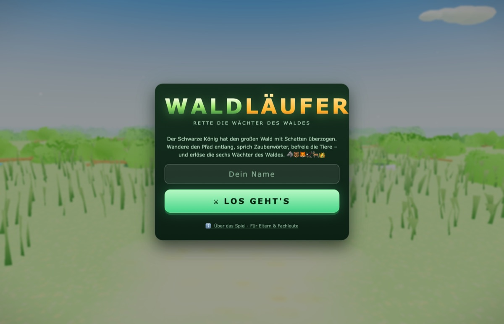
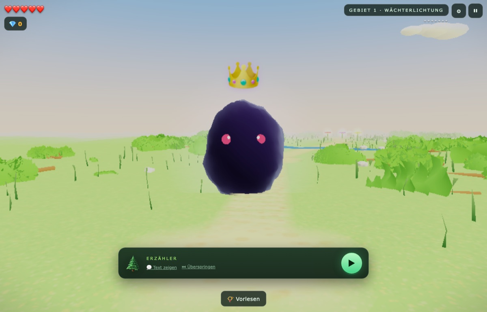
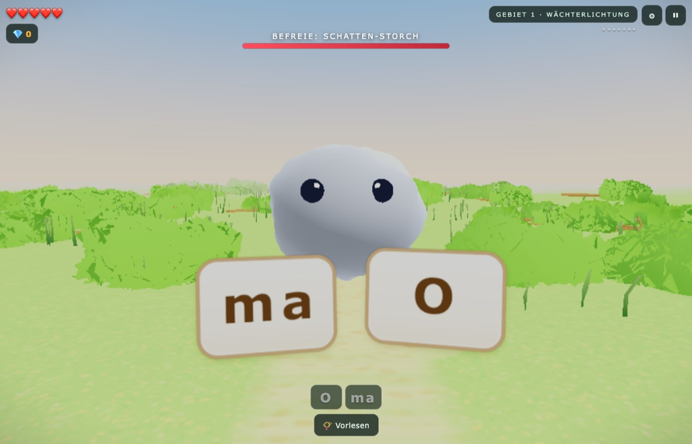

# WALDLÄUFER 🌲

Ein Lernspiel für Kinder mit LRS (Lese-Rechtschreib-Störung) — es sieht aus
wie ein Abenteuerspiel, aber jede Mechanik ist eine verkleidete Leseübung.
Kein Frontalunterricht, kein Drill: der Wald ist von einem Schwarzen König
verzaubert worden, sechs Wächter des Waldes warten auf Erlösung, und der
Weg dorthin führt durch Silben, Wörter und Sätze.

**Live spielen:** https://waldlaeufer.oratio.co

<p align="center">
  
  
  
</p>

## Worum es geht

Waldläufer ist kein Vokabeltrainer im Spielkostüm — die Leseförderung ist
unsichtbar in die Spielmechanik eingebaut:

- **Zaubern/Brücken bauen** — Wörter aus Silbenkarten in der richtigen
  Reihenfolge zusammensetzen (Dekodieren, nach Reuter-Liehr).
- **Abwehrwort-Blitzlesen** — häufige Funktionswörter unter Zeitdruck
  erkennen, inklusive visuell ähnlicher Distraktoren (Automatisierung).
- **Flüsterblumen** — ganze Sätze lesen und in Spielhandlung übersetzen,
  ohne Vorsprechen vor dem ersten Fehler (Sinnentnahme).

Im Hintergrund läuft eine Leitner-Lern-Engine: jedes Wort hat eine Box
(0–4), Fehler kosten nie Punkte, sondern lösen gestuftes Scaffolding aus
(Wort vorsprechen, dann die richtige Silbenkarte pulsieren lassen).
Schwieriger wird es ausschließlich durch **Entzug des Scaffoldings**
(Fading-Prompt), nie durch schwerere Wörter. Vier Stufen lautgetreuer
Progression führen von offenen Zweisilbern bis zu Komposita und Morphemen.

Ein Eltern-/Therapeuten-Panel zeigt Live-Reports (geübte Wörter,
Fehlerfrei-Quote, Mastery-Fortschritt je Stufe) und erlaubt
Wortschatz-Pakete sowie eigene Förderwörter pro Profil — Spielstände
bleiben lokal auf dem Gerät (kein Account, Export/Import als Datei für
den Gerätewechsel).

## Tech-Stack

- **Three.js** (r128) für die 3D-Welt, WebGL-Shader für die
  Schattengeister-Gegner
- **Vite** als Dev-Server/Build (touch-first, getestet auf iPad/Safari)
- **Web Speech API** für deutsches TTS, gekoppelt an jede Silbe/jedes Wort
- Reine Frontend-App, kein Backend — Lernstand liegt in `localStorage`

## Entwicklung

```bash
npm install
npm run dev     # startet mit --host → Test auf dem iPad im selben WLAN
npm run build   # Produktions-Build nach dist/
```

Deployment: automatischer Push auf `main` → statischer Build via Coolify.

## Mehr

Die vollständigen Design- und Lerntherapie-Prinzipien (Silbensynthese,
Leitner-Engine, Mastery-Gating, bekannte technische Fallstricke, Roadmap)
stehen in [CLAUDE.md](CLAUDE.md). Die Wortlisten der Lern-Engine liegen in
`src/learning/words.json` und sind austauschbar.
